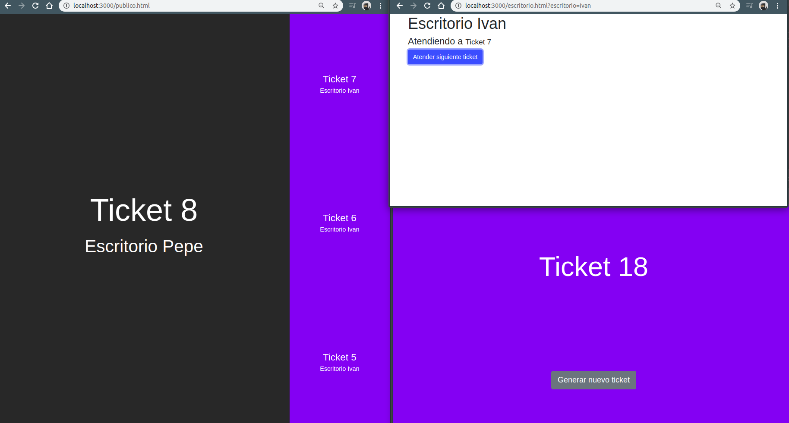

# Tickets-List:

This app automates the task of taking turns. Manager multiple desks for public attention.



## Functions
- You can take tickets.
- You can create desktops.
- Any Desk can take the next ticket to attend.
- It has a page to visualize to which Desk each ticket should go.

## Technology

- This is a small Node-Express app ready to run.
- Use Sockets to communicate.
- A database isn't used. The data is saved in a JSON file inside the *./server/data/* folder.

## Note

This docker is for the developer's propose. Don't use them for Production environments.

This project no populates the database, you need to create and populate the database.

Remember exec the next command

```
npm install
```

# Docker Notes

- exec a shell on this docker: ```docker exec -it app_ticket sh --color=auto```

- Install new dependencies from inside the container.

- Build the project from inside the container.

- If you erase the dist folder, you need to rebuild it.

- If you erase the node_modules folder, this deletes the reference on the container. You need reinstall dependencies with ```npm install``` inside of the container.